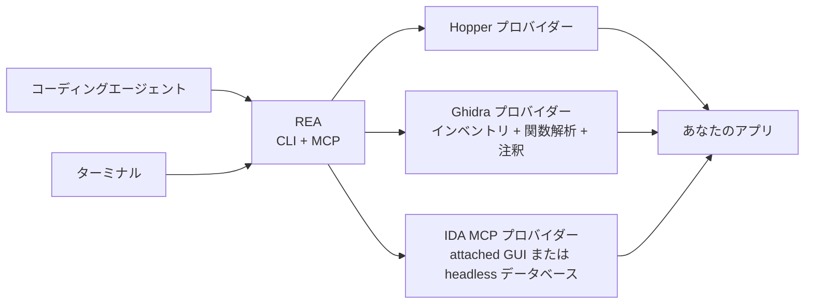

<div align="center">

[English](README.md) · [简体中文](README_zh.md) · **日本語** · [한국어](README_ko.md) · [العربية](README_ar.md)

# REA：あらゆるものをリバースエンジニアリング

### バイナリ、アプリ、実行時の動作をひとつの MCP でリバースエンジニアリング。

**気に入った機能を見つけたら、その仕組みをバイナリのレベルまで理解する。**

[](https://www.npmjs.com/package/rea-agents)
[](https://github.com/morluto/rea/actions/workflows/ci.yml)
[](#調査ツールカタログ)
[](https://nodejs.org/)
[](LICENSE)
[](https://discord.gg/GkcryMnJDM)

<a href="https://trendshift.io/repositories/82054?utm_source=repository-badge&amp;utm_medium=badge&amp;utm_campaign=badge-repository-82054" target="_blank" rel="noopener noreferrer"></a>

**[ウェブサイト（英語）](https://morluto.github.io/rea/) · [ガイド](https://morluto.github.io/rea/guides/) · [DX-Ball の事例](https://morluto.github.io/rea/showcase/dx-ball/)**

[クイックスタート](#クイックスタート) · [現在の対応状況](#現在の対応状況) · [バイナリから動作へ](#バイナリから動作へ) · [調査ツールカタログ](#調査ツールカタログ) · [ロードマップ](#ロードマップ) · [仕組み](#仕組み)

<table aria-label="REA community">
<tr>
<td align="center" width="360">
  <a href="https://discord.gg/GkcryMnJDM">
    <br />
    <strong>リバースエンジニアリングのコミュニティに参加</strong>
  </a><br />
  <sub>Discord · 質問と回答 · 成果の共有</sub>
</td>
</tr>
</table>

<br />

<code>npx rea-agents setup</code>

<br />


</div>

---

自分のプロダクトにも欲しい機能を他のアプリで見つけたら、REA を使ってエージェントに調査を依頼できます。エージェントはソースコードがなくてもアプリを調べ、機能の仕組みを説明して根拠を示し、あなたのプロジェクト向けの実装まで進められます。

REA は、ネイティブバイナリ、JavaScript/Electron アプリ、.NET アセンブリ、Web サイトを調べるためのツールをエージェントに提供します。同じツールはターミナルからも使えます。解析はローカルで実行され、結果には各結論の根拠と制限が含まれます。

セットアップは REA をエージェントに登録し、対応するワークフロー手順もインストールします。ネイティブ解析には既存の Hopper または Ghidra を使えます。承認すれば、セットアップで Hopper をインストールすることもできます。静的な JavaScript 解析にはどちらのエンジンも不要です。

## エージェントに頼むだけ

[セットアップ](#クイックスタート)後にエージェントを再起動し、次のように依頼します：

```text
メモアプリの検索機能を調べて根拠を示し、私のプロジェクト向けに同様の機能を実装してください。
```

「メモアプリ」を調べたいアプリに置き換えてください。まずは概要の調査を依頼することもできます。

## バイナリから動作へ

| 逆コンパイル                                                                                                                     | 理解                                                                                                                       | 再現                                                                                       |
| -------------------------------------------------------------------------------------------------------------------------------- | -------------------------------------------------------------------------------------------------------------------------- | ------------------------------------------------------------------------------------------ |
| ネイティブアプリや実行ファイルから、プロシージャ、疑似コード、アセンブリ、文字列、シンボル、セグメント、メタデータを復元します。 | 呼び出し元、呼び出し先、クロスリファレンス、コールグラフをたどり、機能やアルゴリズムの実際の動作を説明できる状態にします。 | エージェントが得た知見を、あなたの技術スタック、画面、要件に合うプロダクト機能へ変えます。 |

REA は結論に至った根拠を示します。元のソースコードを復元できる、あるいはアプリ全体を自動的に複製できるとは主張しません。

## REA を選ぶ理由

|                            |                                                                                                          |
| -------------------------- | -------------------------------------------------------------------------------------------------------- |
| **エージェント向け**       | アプリの動作を質問すると、エージェントが推測ではなく実際に調べて答えます。                               |
| **CLI と MCP**             | 同じリバースエンジニアリング機能を、ターミナルからもエージェントからも使えます。                         |
| **ガイド付きセットアップ** | エージェントの設定、既存の解析ツールへの接続、承認したうえでの Hopper のインストールに対応します。       |
| **洞察からコードへ**       | 機能を理解したら、同じコーディングセッションで自分のプロダクト向けに実装できます。                       |
| **ローカルで解析**         | 解析は対応するローカルホストで実行されます。REA がアプリをホスト型の解析サービスへ送ることはありません。 |
| **コンテキストを維持**     | 質問のたびに解析をやり直すことなく、複数のアプリを続けて調査できます。                                   |

## クイックスタート

### セットアップを実行（推奨）

REA をエージェントで使えるように設定します：

```bash
npx rea-agents setup
```

セットアップでは、まず REA を使うエージェントを選び（複数選択可）、具体的なパスと変更内容を確認してから承認します。既存の REA 登録は最初から選択されています。新しく検出されたエージェントは選択肢に表示されますが、検出されただけでは選択されません。選択したエージェントには、MCP 接続と REA のガイド付きワークフローが追加されます。Hopper のインストールは別の任意項目で、個別に承認が必要です。既存の Ghidra のインストール先を登録することもできます。

セットアップは変更を適用する前に内容を表示し、既存の設定をバックアップします。要件とセットアップのオプションは[インストールガイド](docs/installation.md)を参照してください。

### エージェントで使う（推奨）

セットアップ後にエージェントを再起動し、理解したいアプリや機能を[説明してください](#エージェントに頼むだけ)。Hopper はデモモードでも動作します。初回起動の画面が表示されたら、デモを選ぶか既存のライセンスを入力してください。

REA は Claude Code、Claude Desktop、Codex、Cursor、Gemini CLI、Windsurf、Devin、OpenCode、Antigravity、GitHub Copilot CLI、Command Code、VS Code に対応しています。セットアップでは既存の REA 登録が最初から選択され、それ以外の検出済みエージェントは選択するまで対象になりません。その他のエージェントは[手動の MCP 設定](#他のコーディングエージェントで使う)を使えます。

### AI コーディングアシスタント向けスキル（任意）

AI コーディングアシスタントにスキルを追加すると、より豊富なコンテキストを利用できます：

```bash
npx skills add morluto/rea --skill reverse-engineer-anything
```

このスキルは REA の調査ワークフローを提供します。REA をエージェントに接続して解析ツールを設定するには、上記のセットアップを実行してください。セットアップは既定でバージョンの一致したスキルをインストールします。このコマンドはリポジトリ版のスキルをインストールします。

### ターミナルで最初の結果を得る

展開済みの JavaScript/Electron アプリのディレクトリまたは ASAR に対して、次を実行します：

```bash
npx -y rea-agents@latest analyze-javascript-application /absolute/path/to/app --json
```

パスは調査対象に置き換えてください（Windows では `"D:/apps/example"` など）。MCP の設定、Hopper、Ghidra を必要とせず、アプリを実行することもなく、Evidence、復元したグラフ、制限、未解決事項をその場で返します。ネイティブアプリの場合は、先にエンジンを設定してから、そのアプリのパスを指定して `analyze` を使います。`doctor` は問題を診断したいときに使うもので、解析のたびに実行する必要はありません。

### 作業に合わせて準備状況を確認する

オプションなしの `rea doctor` は連携全体の監査です。検出したすべてのエージェント登録、インストール済みのスキル、すべての任意の解析エンジンを確認するため、今の作業には支障がなくても `healthy: false` を報告することがあります。作業に合わせて確認範囲を指定してください：

| 作業                                       | 準備状況の確認                                                                                 |
| ------------------------------------------ | ---------------------------------------------------------------------------------------------- |
| 静的な JavaScript/Electron 解析            | 不要です。`analyze-javascript-application` を直接実行します。                                  |
| 特定の解析エンジンのトラブルシューティング | `rea doctor --provider ghidra --json`（または `hopper`、`ida`）                                |
| 特定のエージェントの MCP 登録を確認        | `rea doctor --client codex --json`（[クライアント ID](docs/installation.md#supported-agents)） |
| インストール済みのスキルを確認             | `rea doctor --skill --json`                                                                    |

範囲を指定したレポートでは、`healthy` と終了ステータスを決めるのは `scope_checks` だけです。それ以外の項目は `informational_checks` に表示され、今の作業のために修正する必要はありません。たとえば、使っていないエンジンが見つからなくても対処は不要です。

ネイティブ対象に対応するエンジンが複数インストールされている場合、REA は自動ではどれも選びません。対象を開くと `code: "capability_unavailable"` と `details.selection_reason: "ambiguous"` で失敗し、`details.candidate_ids` に候補が示されます。CLI の `--provider` か `open_binary` の `provider_id` で一度選ぶか、常用する設定として `REA_ANALYSIS_PROVIDER` を指定してください。詳しくは[英語版の解説](README.md#choosing-a-deep-analysis-provider)を参照してください。

### rea コマンドをインストール

コマンドラインツールをインストールします：

```bash
curl -fsSL https://raw.githubusercontent.com/morluto/rea/main/install.sh | bash
```

Node.js と npm を先にインストールしておいてください。ターミナルで実行すると、インストーラーは `rea` を追加してセットアップを開始します。

npm でインストールしてから、セットアップを実行することもできます：

```bash
npm install --global rea-agents
rea setup
```

### 要件

静的な JavaScript 解析に必要なのは Node.js と npm だけです。ホストと外部ツールの前提条件は使うワークフローによって異なり、ネイティブ解析プロバイダーの対応プラットフォームは各ガイドで説明しています。

- macOS 12 以降
- Ubuntu 24.04+、Fedora 41+、64 ビット Arch Linux、または CachyOS
- Node.js 22.x (>=22.19)、24.x (>=24.11)、または 26+
- npm（特定のバージョンは不要で、REA が npm をインストールすることもありません）

ネイティブバイナリの詳細な解析には Hopper、Ghidra、IDA Pro のいずれかが必要です。Hopper は独自のライセンスを持つ別製品で、デモ版でもベンダーが定める制限の範囲で解析できます。Ghidra と IDA は、利用者が用意したものを使います。

Ghidra は Linux x64 と macOS x64/arm64 に対応しています。Ghidra 12.1.x と、そのインストールが宣言する 64 ビットの完全な JDK（`application.java.min` から `application.java.max` まで）を別途インストールし、REA で使うように設定してください。現行の 12.1 リリースは JDK 21 以降を必要とし、上限はありません。ブリッジは Ghidra 12.1.4 と JDK 21 で検証しています。macOS では、ホストのアーキテクチャに合うネイティブデコンパイラーも必要です。

```bash
export GHIDRA_INSTALL_DIR=/absolute/path/to/ghidra_12.1.4_PUBLIC
export JAVA_HOME=/absolute/path/to/jdk-21 # java と javac が PATH から解決できる場合は省略可
rea doctor --provider ghidra --json
rea setup
```

セットアップはこれらのインストールを確認し、承認後にパスを保存します。Ghidra、Java、Node.js、npm、Homebrew のインストールや更新は行いません。

IDA Pro は、すでに動作している [mrexodia/ida-pro-mcp](https://github.com/mrexodia/ida-pro-mcp) の MCP 登録を再利用します。開いている GUI の対象を読み取り専用で解析するか（`attached`、既定）、データベースのスーパーバイザーで指定したバイナリをヘッドレスで開いて解析します（`headless`）。REA が attached の GUI データベースを保存したり閉じたりすることはありません。最初の実環境での検証は、Windows の GUI と Windows x64 のヘッドレス IDA 9.3 が対象です。設定方法と対応範囲は [IDA プロバイダーガイド](docs/ida-provider.md)を参照してください。

```bash
export REA_IDA_MCP_CONFIG=/absolute/path/to/ida-mcp.json
rea function /absolute/path/to/program main --provider ida --json
```

リポジトリの main と npm 4.1.0 には、ローカル NTFS 上のネイティブ x86-64 PE アプリケーション（マネージドコードと DLL を除く）を対象とする、実験的な Windows x64 Ghidra P0 対応が含まれています。Job Object、プライベート DACL、パスの受け入れ検査の各制御も同梱されています。古い npm パッケージでこの機能を使えるか確認するには[リリース境界](docs/installation.md#released-package-and-main)を、前提条件と検証済みの範囲は [Windows Ghidra P0](docs/windows-ghidra-p0.md) を参照してください。

### トラブルシューティング

`npx -y rea-agents@latest doctor` は、ホスト、依存関係、解析ツール、エージェント設定を変更せずに確認します。構造化された診断結果が必要な場合は `--json` を追加してください。

Linux では実行可能な `/opt/hopper/bin/Hopper` を優先し、利用できない場合は `~/.local/share/rea/hopper/bin/Hopper` を自動的に確認します。それ以外の場所にインストールした場合は `HOPPER_LAUNCHER_PATH` を設定してください。ファイルがあるのに解析エンジンが見つからないと報告される場合は、実際の Hopper のパスに対して `ldd /absolute/path/to/Hopper | grep 'not found'` を実行し、不足しているライブラリを確認してください。詳しくは [Hopper ガイド](docs/installation.md#hopper)を参照してください。

### 更新とアンインストール

- `rea update` は現在の REA インストールを更新します。
- `rea uninstall` は REA が管理するエージェント登録とスキルだけを削除します。Hopper、Node.js、Evidence ファイル、キャプチャ、無関係なスキル、他の MCP サーバーは残ります。
- `rea uninstall --purge-data` は `~/.rea/cache` と `~/.rea/state` も削除します。それらを消したい場合にだけ使ってください。

## 現在の対応状況

リポジトリの現在の機能とプラットフォーム要件は[英語の対応状況ガイド](README.md#current-status)で説明しています。main は [npm リリース](docs/installation.md#released-package-and-main)より先行する場合があります。

- Ghidra は Linux x64、macOS x64/arm64、実験的な Windows x64 P0 境界で 25 種類の読み取り専用操作を提供します。Linux と macOS では、セッション内での関数名とエントリーコメントのアトミックな編集にも対応します。Windows P0 には変更の権限がなく、Ghidra には REA から操作できる GUI 機能はありません。
- IDA アダプターは、ドキュメントに記載された読み取り専用の関数・文字列操作を提供します。
- 静的な Android APK の検査は Linux と macOS に対応し、別途用意したヘッドレス JADX と完全な JDK が必要です。現在のメタデータブリッジは macOS arm64 で検証しています。詳しくは [Android 解析](docs/android-analysis.md)を参照してください。
- ブラウザー、Electron、プロセスの各リクエストは対象、操作、ライフサイクルを直接指定し、ホストで実際に許可されたアクセスの範囲で動作します。REA 側で別途権限を付与する必要はありません。セットアップによる設定の書き込みと Hopper のインストールには、引き続き具体的な計画の承認が必要です。
- `rea capabilities` と `rea providers` はバイナリセッションのプロバイダーと補助操作を説明するもので、ブラウザー、Android、アプリのすべてのワークフローの一覧ではありません。MCP の機能全体は、接続中の MCP ツール一覧と `binary_session` が示すツールの利用可否で確認してください。

## ひとつのプロンプトで調査を完結

```text
メモアプリをリバースエンジニアリングし、オフライン検索機能の仕組みを説明して、
TypeScript と SQLite を使って私のプロジェクト向けに実装してください。
```

| 手順 | エージェントの処理             | REA ツール                                                       |
| ---: | ------------------------------ | ---------------------------------------------------------------- |
|    1 | バイナリを開いて識別           | `open_binary`, `binary_overview`                                 |
|    2 | オフライン検索の手掛かりを探す | `search_strings`, `search_procedures`, `list_names`              |
|    3 | 手掛かりを実行コードに結び付け | `find_xrefs_to_name`, `xrefs`, `procedure_callers`               |
|    4 | 関連する制御フローを復元       | `get_call_graph`, `procedure_callees`, `procedure_info`          |
|    5 | 関連する処理を逆コンパイル     | `procedure_pseudo_code`, `procedure_assembly`, `batch_decompile` |
|    6 | プロジェクトに機能を実装       | 技術スタック、プロダクト、要件に合わせたコード                   |

手順 1〜5 のアプリ解析は REA が担当します。手順 6 は、アプリについて得た知見をもとに、エージェントが通常の編集ツールとテストツールで行います。

## エージェントにできること

- 気に入った機能を調査し、自分のプロダクトに合わせた形で実装する。
- ソースコードが手に入らない機能の仕組みを説明する。
- アプリの認証、保存、更新、ネットワーク処理の流れを復元する。
- 文書化されていない形式やインターフェースについて、文書化に必要な構造を復元する。
- 文字列やシンボルから、疑わしい動作を実装しているコードまでたどる。
- 復元した動作を、プロダクト機能、テスト、移行メモ、移植版、相互運用できる代替実装に変える。
- マングルされたシンボルをひとつずつ手作業で読み解かなくても、Swift と Objective-C のメタデータを解析する。
- Hopper に名前、コメント、ブックマークを残し、人とエージェントの解析を互いに活かす。

## 調査ツールカタログ

| ツール分類           |  数 | 用途                                                                                                                                                                  |
| -------------------- | --: | --------------------------------------------------------------------------------------------------------------------------------------------------------------------- |
| ネイティブ検査       |  41 | 関数、疑似コード、アセンブリ、文字列、シンボル、呼び出し、参照、注釈、バイト読み取り、ファイルオフセット                                                              |
| 調査ワークフロー     |  14 | アプリ概要、関数ドシエ、ネイティブ API とディスパッチ、一括逆コンパイル、機能トレース、コールパス、コールグラフ、Swift と Objective-C の検出                          |
| macOS ネイティブ     |   7 | Hopper を起動せずに扱える Mach-O メタデータ、コード署名、plist、アーキテクチャ、Swift シンボルのデマングル                                                            |
| 成果物グラフ         |   5 | ディレクトリとパッケージの目録、コンパイル済み Interface Builder ファイル、Apple アセットカタログ、抽出                                                               |
| マネージド PE/CLI    |   7 | .NET の識別情報、メタデータ、CIL 命令、ネイティブ依存関係、再構築結果のインポート、ビルド比較                                                                         |
| ファームウェア       |   2 | Linux ファームウェア領域の検査と明示的な展開                                                                                                                          |
| Android APK          |   5 | パッケージと manifest の宣言、クラス検索、メンバー一覧、メソッドの逆コンパイル、静的な被参照                                                                          |
| ブラウザー観察       |  11 | ページ構成、ネットワークメタデータ、スクリプト、ソースマップ、WebMCP の検出、スクリーンショット、キャプチャ比較                                                       |
| Electron 解析        |   5 | レンダラーの観察、静的なアプリのマッピング、静的結果と実行時結果の照合                                                                                                |
| JavaScript 実行時    |   2 | Node/Electron Inspector の対象検出、スクリプトの位置、実行コンテキストのイベント                                                                                      |
| アプリワークフロー   |  13 | 取得した Web スクリプトのエクスポート、Android/Apple の目録の投影、層をまたぐ機能トレース、ビルド比較、過去のソースとの対応付け、静的な戻り値形状の比較、再構築の検証 |
| ワークスペースと観察 |  21 | セッション、Evidence バンドル、ナビゲーションの文脈、プロセス・成果物・関数の比較、未解決事項の記録                                                                   |

## ロードマップ

[現在の対応状況](#現在の対応状況)は提供済みの機能です。今後の作業は次のとおりです。

- **現在：** ツール、プロバイダー、セットアップの選択肢、バージョンの変更に合わせてドキュメントを正確に保ち、Hopper と Ghidra で検証するネイティブバイナリのアーキテクチャと間接呼び出しの範囲を広げます。
- **次：** 機能トレースに静的抽出と実行時の観察を追加し、難読化された .NET アセンブリの比較を改善し、プロセス、プロトコル、ファイルシステム、再接続、バージョン比較の範囲を広げます。
- **その後：** ブラウザーと Electron のシナリオ操作を増やし、LLDB や Frida などによるネイティブアプリの実行時観察と、他の解析ツールや対象の評価を進めます。

セットアップでは、すでにエージェント連携と Hopper のインストールを選べます。その他の解析ツールのインストールへの対応は今後の作業です。[インストールのロードマップ](docs/roadmap.md)と[解析ツールの評価](docs/provider-evaluation.md)を参照してください。

## 他のコーディングエージェントで使う

セットアップは Claude Code、Claude Desktop、Codex、Cursor、Gemini CLI、Windsurf、Devin、OpenCode、Antigravity、GitHub Copilot CLI、Command Code、VS Code に対応しています。既存の REA 登録は最初から選択され、それ以外の検出済みエージェントは選択するまで対象になりません。ローカル MCP サーバーに対応するエージェントであれば、次の設定でも接続できます。

<!-- x-release-please-start-version -->

```json
{
  "mcpServers": {
    "rea": {
      "command": "npx",
      "args": ["-y", "rea-agents@5.0.0", "mcp"]
    }
  }
}
```

<!-- x-release-please-end -->

常用する登録では、パッケージのバージョンを 1 つに固定してください。`rea setup` はその固定バージョンを維持し、同梱のスキルも同時に更新します。

## 仕組み



CLI と MCP サーバーは、同じアプリケーションワークフローと Evidence の契約を使います。ターミナルのコマンドは完了すると自身のブリッジセッションを解放し、エージェントのセッションは調査中の対象と Evidence を保持できます。REA のセッションを閉じても、利用中の Hopper アプリは終了しません。

## CLI

上のエージェントワークフローが、REA を使う最も簡単な方法です。ターミナルからアプリの概要を一度だけ調べる場合は、次を実行します。

```bash
npx -y rea-agents@latest analyze /Applications/Notes.app
```

直接の逆コンパイルやその他のオプションは、`npx -y rea-agents@latest --help` で確認できます。

グローバルな `rea` コマンドとしてもインストールできます。

```bash
npm install --global rea-agents
rea --help
rea mcp
```

REA は Mac の `.app` フォルダーを直接開けます。エージェントがアプリを名前で見つけられない場合は、インストール場所を伝えてください。

## Hopper アプリの動作

REA は操作に必要になった時点で Hopper を起動します。Hopper のランチャーは内部でアプリをアクティブにするため、REA がバックグラウンドでの起動を要求しても、macOS では Hopper のウィンドウやダイアログが前面に出る場合があります。デモやライセンスの画面では操作が必要になることがあります。

Hopper は解析リクエストを一度に 1 つずつ処理します。待機をキャンセルしても、Hopper 内ですでに実行中の処理は止まりません。処理中かどうかはセッションが報告します。セッションを閉じると REA のブリッジと一時ソケットディレクトリを削除しますが、利用中の Hopper アプリは終了しません。後片付けを確認できなかった場合、`close_binary` は `cleanup_incomplete` と対象のリソースを報告します。

## セキュリティモデル

解析はローカルで実行されます。REA は Hopper や Ghidra とは認証付きのプライベートなローカルソケットで、IDA とは設定済みのローカル MCP 登録を通じて通信します。Ghidra セッションは隔離された一時プロジェクトを使い、ユーザーの Ghidra プロジェクトを開いたり変更したりしません。

これはサンドボックスではありません。解析ツールと起動した対象は現在のユーザー権限で動作し、同じ OS ユーザー権限で動く悪意のあるプロセスは防げません。Windows Ghidra P0 では、ネイティブの Job Object、保護されたプライベート DACL、ハンドルベースの受け入れ検査を自動的に使います。脆弱性は [SECURITY.md](SECURITY.md) に記載された非公開の手順で報告してください。

## FAQ

<details><summary><strong>Hopper を先に起動しておく必要はありますか？</strong></summary>

いいえ。REA は必要になった時点で Hopper を起動します。すでに起動している Hopper でも使えますが、既存の GUI ドキュメントには接続せず、新しい解析ドキュメントを開きます。

</details>

<details><summary><strong>REA に Hopper は含まれていますか？</strong></summary>

含まれていません。セットアップで Hopper をインストールできますが、Hopper は独自のライセンスを持つ別製品です。REA は、エージェントが Hopper を使えるようにする CLI、MCP サーバー、ワークフローを提供します。

</details>

<details><summary><strong>REA は Ghidra や Java をインストールしたり同梱したりしますか？</strong></summary>

いいえ。REA は既存の Ghidra のインストールに接続します。[要件](#要件)にある Ghidra と Java のパスを設定してから、セットアップを実行してください。

</details>

<details><summary><strong>アプリはアップロードされますか？</strong></summary>

REA にホスト型の解析サービスはありません。現在のプロバイダーは、成果物の解析と動作のキャプチャをローカルで行います。エージェントやモデルの提供元には独自のデータポリシーがあるため、別途確認してください。

</details>

<details><summary><strong>元のソースコードを復元できますか？</strong></summary>

元のソースコードを確実に復元できるデコンパイラーはありません。REA はエージェントに疑似コード、アセンブリ、シンボル、文字列、メタデータ、それらの関係を提供し、観察された動作の説明や互換性のある再現に役立てられるようにします。

</details>

## 開発

開発環境、アーキテクチャ、テスト、リリース手順は [CONTRIBUTING.md](CONTRIBUTING.md) を参照してください。

## ライセンス

[MIT](LICENSE)
